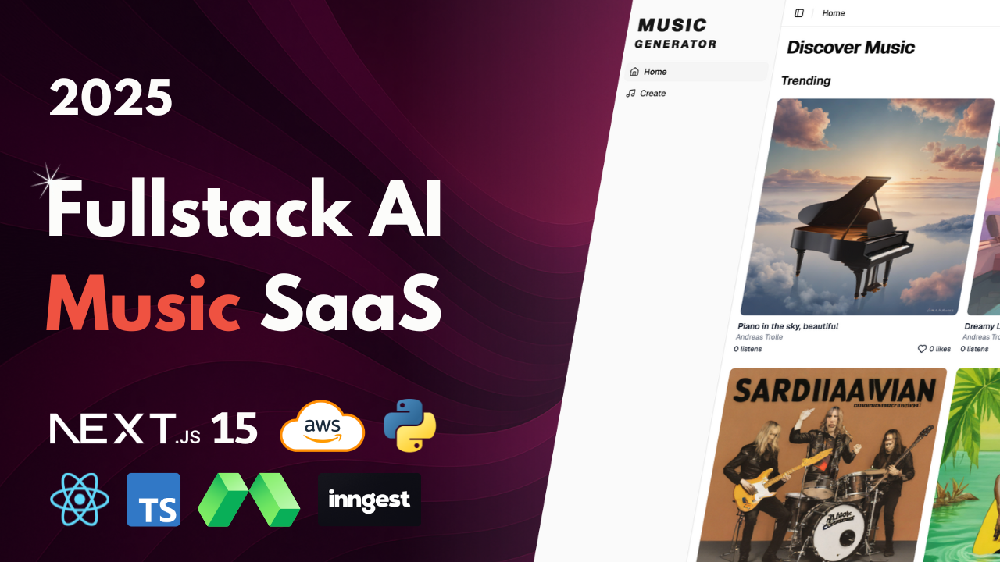

# Music Generator SaaS

  

  
  
  

> A full-stack AI music creation platform by <a href="https://github.com/sh-arka22">Arka Jyoti Saha</a>, combining state-of-the-art generative audio, LLM-assisted songwriting, GPU-backed serverless execution, and a polished Next.js experience.

---

## Table of Contents
- [✨ Highlights](#-highlights)
- [🏗️ System Architecture](#️-system-architecture)
- [📁 Directory Structure](#-directory-structure)
- [🛠️ Tech Stack](#️-tech-stack)
- [🚀 Quick Start](#-quick-start)
  - [Backend (Modal)](#backend-modal)
  - [Frontend (Next.js)](#frontend-nextjs)
  - [Queue Worker (Inngest)](#queue-worker-inngest)
- [⚙️ Configuration](#️-configuration)
  - [Environment Variables](#environment-variables)
  - [AWS S3 Setup](#aws-s3-setup)
  - [Database (Neon + Prisma)](#database-neon--prisma)
  - [Modal Setup](#modal-setup)
  - [Inngest Setup](#inngest-setup)
- [🎵 Generation Modes & API](#-generation-modes--api)
- [⚡ Processing Pipeline](#-processing-pipeline)
- [🚀 Deployment & Ops](#-deployment--ops)
- [🔒 Security & Privacy](#-security--privacy)
- [🛠️ Troubleshooting](#️-troubleshooting)
- [❓ FAQ](#-faq)
- [🗺️ Roadmap](#️-roadmap)
- [🤝 Contributing](#-contributing)
- [👨‍💻 Maintainer](#-maintainer)
- [📄 License](#-license)

---

## ✨ Highlights

- **ACE-Step diffusion audio model** for high-fidelity music synthesis
- **Qwen2-7B-Instruct** powers prompt expansion, lyric writing, and auto-tagging
- **SDXL Turbo** generates album-ready artwork on the fly
- **Modal GPU functions** keep inference scalable without server management
- **Next.js 15 + BetterAuth** deliver a production-ready SaaS front end and auth
- **Credit-based monetization** via Polar checkout & customer portal
- **Inngest queue** gives smooth background processing and reliable orchestration
- **AWS S3 integration** for song storage, streaming, and thumbnail delivery

---

## 🏗️ System Architecture

